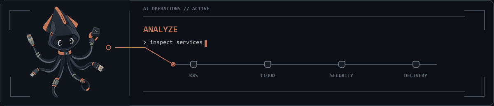

<picture>
  <source media="(prefers-reduced-motion: reduce)" srcset="./assets/profile-frame-static.png">
  
</picture>

<h1 align="center">Deric San Andres</h1>

<strong>Senior DevOps &amp; Infrastructure Engineer</strong>

I combine DevOps expertise with AI-assisted engineering across the delivery lifecycle—from development and staging to production—to diagnose critical issues faster, automate recovery, and deliver reliable solutions under pressure.

<strong><a href="https://modern-portfolio-seven-opal.vercel.app">View portfolio</a></strong> · Manila, Philippines

## About

I architect and operate cloud infrastructure across Azure, Kubernetes, infrastructure as code, CI/CD, Linux, and production observability. My focus is straightforward: repeatable deployments, resilient systems, and operational signals that help teams act quickly.

Across development, staging, and production, I use AI-assisted diagnostics and automation to shorten investigations, reduce repetitive work, and move from signal to resolution faster.

## Specialties

  
<strong>Infrastructure</strong>

  

    
    &nbsp;&nbsp;&nbsp;
    
    &nbsp;&nbsp;&nbsp;
    
    &nbsp;&nbsp;&nbsp;
    
    &nbsp;&nbsp;&nbsp;
    
  

  DevOps · Kubernetes · Azure · AWS · Google Cloud

  
<strong>AI engineering</strong>

  

    
    &nbsp;&nbsp;&nbsp;
    <picture>
      <source media="(prefers-color-scheme: dark)" srcset="https://cdn.jsdelivr.net/gh/glincker/thesvg@main/public/icons/codex/dark.svg">
      <source media="(prefers-color-scheme: light)" srcset="https://cdn.jsdelivr.net/gh/glincker/thesvg@main/public/icons/codex/light.svg">
      
    </picture>
  

  Claude Code · Codex

  
<strong>Security and automation</strong>

  

    
    &nbsp;&nbsp;&nbsp;
    
    &nbsp;&nbsp;&nbsp;
    
  

  Security · Terraform · GitHub Actions

## Impact

- Supported **99.9% system uptime** while leading Docker and Kubernetes initiatives, cluster health, scaling, and proactive monitoring.
- Reduced **mean time to recovery by 60%** through observability and alerting workflows built with Prometheus, Grafana, and Zabbix.
- Reduced **deployment issues by 40%** by strengthening CI/CD workflows and automated unit, integration, and regression testing.

## Featured Work

- **[MCP Blockchain Scanner](https://github.com/dericsanandres/MCP-Server-Ether-Scanner)** — Multi-chain MCP server for whale detection and blockchain analysis, with validation, rate limiting, tests, and documented architecture.
- **[Alumni Information System](https://github.com/dericsanandres/Alumni-Information-System-Web)** — Web-based university and alumni management platform with a companion cross-platform mobile application.
- **[ChartSync](https://github.com/dericsanandres/ChartSync)** — Playlist automation from chart data using Playwright-based collection or an AI prompt.

## Core Stack

| Area | Tools and technologies |
| --- | --- |
| **Cloud** | Azure · AWS · Google Cloud |
| **Infrastructure** | Kubernetes · Docker · Terraform · Pulumi · Ansible · Linux · Nginx |
| **Delivery** | GitHub Actions · GitLab CI · blue/green and canary deployments · automated testing |
| **Observability** | Prometheus · Grafana · Zabbix · incident response · alerting |
| **Development** | Python · TypeScript · JavaScript · PHP · SQL |
| **AI tooling** | OpenAI · Claude Code · MCP · LangChain · AIOps automation |

## Currently

- Preparing for the Azure AZ-104 and AZ-400 certifications.
- Building practical AIOps and MCP-based tooling.
- Expanding infrastructure automation with Terraform and Pulumi.

## Connect

**[Portfolio](https://modern-portfolio-seven-opal.vercel.app)** · [Résumé](https://modern-portfolio-seven-opal.vercel.app/assets/resume.pdf) · [LinkedIn](https://linkedin.com/in/dericsanandres) · [Email](mailto:dercsanandres@gmail.com)
