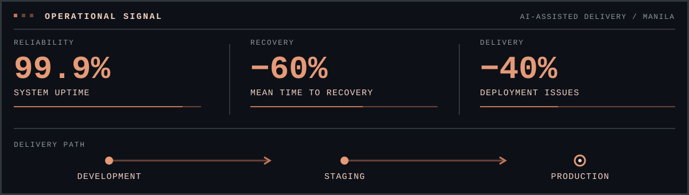
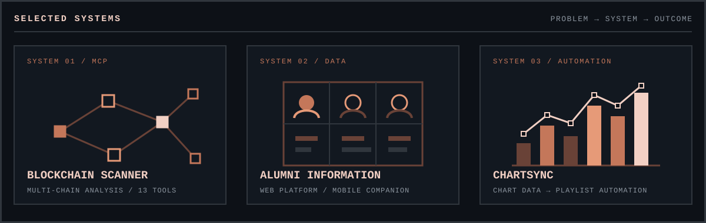

<picture>
  <source media="(prefers-reduced-motion: reduce)" srcset="./assets/profile-frame-static.png">
  
</picture>

<h1 align="center">Deric San Andres</h1>

<strong>Senior DevOps &amp; Infrastructure Engineer</strong>

I design resilient delivery systems and use AI-assisted engineering to move from signal to resolution across development, staging, and production.

  
  
  
  

Manila, Philippines &nbsp;·&nbsp; BUILD → SECURE → OBSERVE → RECOVER

<picture>
  <source media="(max-width: 600px)" srcset="./assets/operations-signal-mobile.svg">
  
</picture>

## Operating profile

I architect and operate cloud infrastructure where reliability has to survive real delivery pressure. My work joins platform engineering, observability, incident response, and infrastructure as code into repeatable systems that teams can understand and recover.

| **Operate** | **Automate** | **Augment** |
| --- | --- | --- |
| Kubernetes, Linux, cloud infrastructure, production observability | Terraform, Pulumi, Ansible, CI/CD, deployment strategies | AI-assisted diagnostics, MCP tooling, investigation, recovery workflows |

The through-line is practical: better signals, smaller failure domains, faster diagnosis, and fewer manual steps between an issue and a safe resolution.

## Selected systems

<picture>
  <source media="(max-width: 600px)" srcset="./assets/selected-systems-mobile.svg">
  
</picture>

### [MCP Blockchain Scanner](https://github.com/dericsanandres/MCP-Server-Ether-Scanner)

Multi-chain MCP server for whale detection and blockchain analysis. It exposes 13 tools through a validated, rate-limited architecture and works with Claude Code, Claude Desktop, Codex, and other MCP-compatible clients.

`Python` `FastMCP` `Etherscan V2` `async HTTP` `validation` `rate limiting`

### [Alumni Information System](https://github.com/dericsanandres/Alumni-Information-System-Web)

University and alumni management platform built around searchable records, institutional workflows, and a companion cross-platform mobile application.

`JavaScript` `PHP` `SQL` `web platform` `Flutter companion`

### [ChartSync](https://github.com/dericsanandres/ChartSync)

Playlist automation that turns chart data into repeatable listening workflows through Playwright-based collection or an AI-assisted prompt.

`automation` `Playwright` `chart data` `playlist workflows` `AI-assisted`

## Toolchain by layer

| Layer | Working set |
| --- | --- |
| **Cloud** | Azure · AWS · Google Cloud |
| **Platform** | Kubernetes · Docker · Linux · Nginx |
| **Infrastructure as code** | Terraform · Pulumi · Ansible |
| **Delivery** | GitHub Actions · GitLab CI · blue/green and canary deployments · automated testing |
| **Signals and recovery** | Prometheus · Grafana · Zabbix · incident response · alerting |
| **Development** | Python · TypeScript · JavaScript · PHP · SQL |
| **AI systems** | OpenAI · Claude Code · Codex · MCP · LangChain · AIOps automation |

## Current vector

- Preparing for the Azure AZ-104 and AZ-400 certifications.
- Building practical AIOps and MCP-based tooling.
- Expanding infrastructure automation with Terraform and Pulumi.

---

  <strong>Build systems that explain themselves under pressure.</strong> 
  <a href="https://modern-portfolio-seven-opal.vercel.app">Portfolio</a> · <a href="https://modern-portfolio-seven-opal.vercel.app/assets/resume.pdf">Résumé</a> · <a href="https://linkedin.com/in/dericsanandres">LinkedIn</a> · <a href="mailto:dercsanandres@gmail.com">Email</a>

