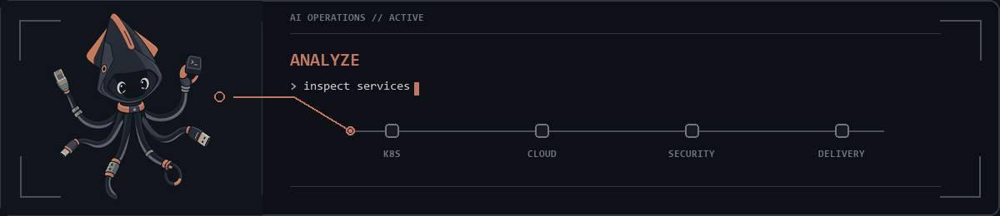

# Deric San Andres

<picture>
  <source media="(prefers-reduced-motion: reduce)" srcset="./assets/profile-frame-static.png">
  
</picture>

Hey, I'm Deric 👋 A DevOps & infrastructure engineer based in Manila.

I build cloud systems, automate the repetitive stuff, and use Claude Code and Codex to help turn ideas into working projects.

  

At MSTR, I’m a Senior DevOps Engineer supporting cloud infrastructure, deployments, and AI-assisted engineering. MSTR is a [Claude Select Services Partner](https://www.mstr.nl/blog/select-services-partner-claude-partner-network), and I use Claude Code in day-to-day delivery work.

Outside work, I’m usually playing Forza, League, NBA 2K, or chess. I also hit the gym, go jogging, and play basketball. Big NBA fan.

[Portfolio](https://modern-portfolio-seven-opal.vercel.app) · [Résumé](https://modern-portfolio-seven-opal.vercel.app/assets/resume.pdf) · [LinkedIn](https://linkedin.com/in/dericsanandres) · [Email](mailto:dercsanandres@gmail.com)

## Things I've built

| Project | A quick look |
| :--- | :--- |
| **[CUDAOps](https://github.com/dericsanandres/cudaops-platform)** Go · CUDA · Kubernetes | My CUDA learning lab. Queue images, process them on CPU or GPU, and monitor the service. |
| **[MCP Blockchain Scanner](https://github.com/dericsanandres/MCP-Server-Ether-Scanner)** Python · FastMCP | Lets AI assistants look up blockchain transactions across multiple chains. |
| **[Alumni Information System](https://github.com/dericsanandres/Alumni-Information-System-Web)** Laravel · MySQL · Flutter | A web app for university and alumni records, with a [mobile companion](https://github.com/dericsanandres/Alumni-Information-System-Flutter). |

## Tools I reach for

**Infrastructure & delivery** — Google Cloud, Linux, Pulumi, Ansible, GitHub Actions, GitLab CI 
**Monitoring & code** — Prometheus, Zabbix, TypeScript 
**AI sidekicks** — Claude Code, Codex, MCP tools

## Lately

Building AIOps and MCP tools, getting deeper into infrastructure automation, and studying for Azure AZ-104 and AZ-400.

---

Have something interesting in mind? [Say hello.](mailto:dercsanandres@gmail.com)
